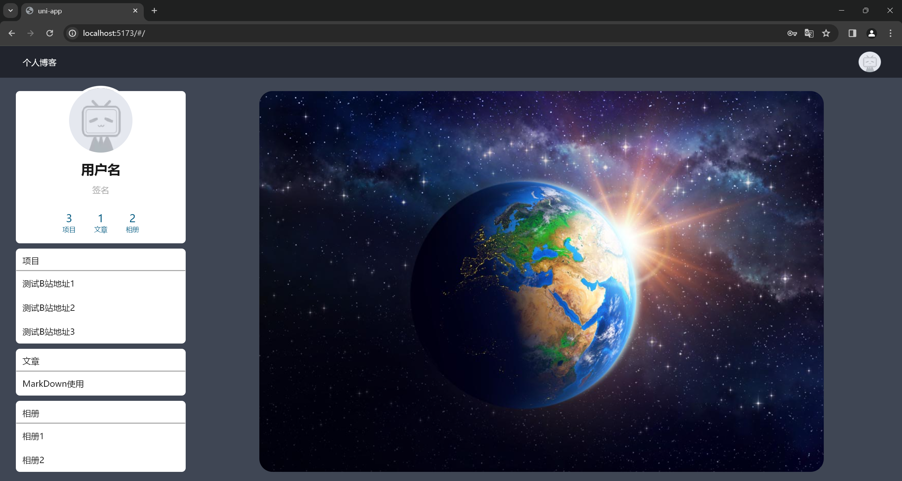
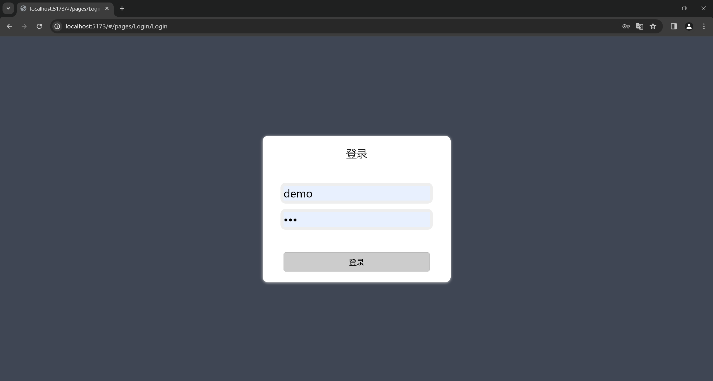
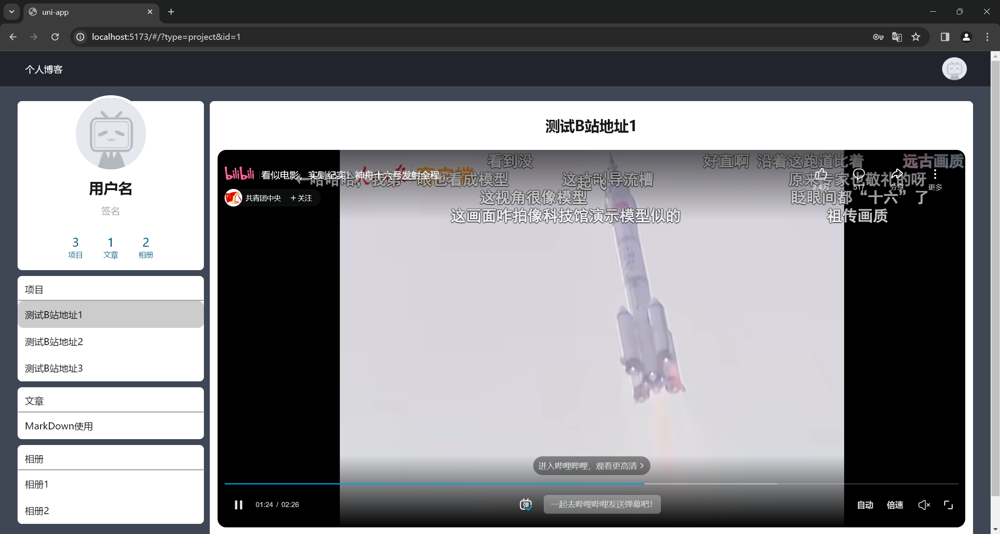
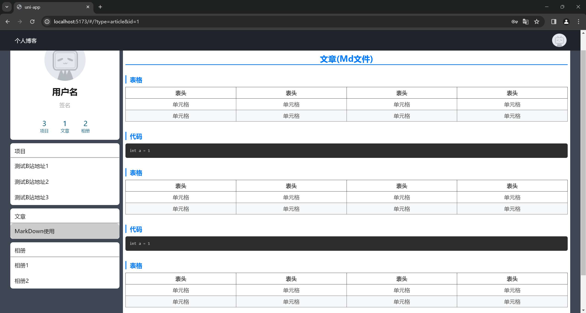
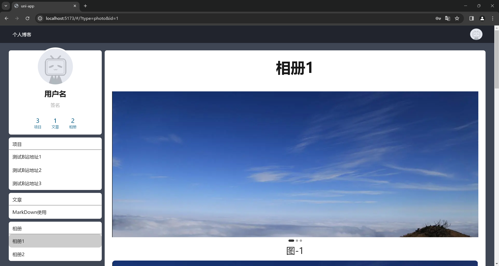
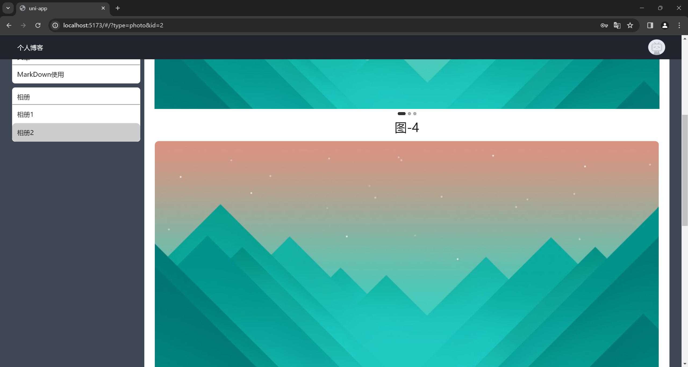

# 个人博客-测试

## 1. 基本信息

- 作者: GMCY
- 仓库: [GitHub](https://github.com/GMCY2020/Vue-PersonalBlog-Test) | [Gitee](https://gitee.com/GMCY2020/Vue-PersonalBlog-Test)
- 话题(GitHub): [vue](https://github.com/topics/vue) \ [test](https://github.com/topics/test)
- 创建时间: 2023/06/13

## 2. 介绍

- 使用 `HBuilder` 尝试编写一个 `个人博客`
- 只写了一点, 就那样了<(＿　＿)>
- 项目写的有亿点差, (#｀-_ゝ-)

## 3. 环境

编辑器
- `HBuilderX`

框架
- `vue`

## 4. 使用

解压后 `HBuilderX` 打开, 运行到浏览器即可.

## 5. 效果图

首页

登录

项目

文章

相册

